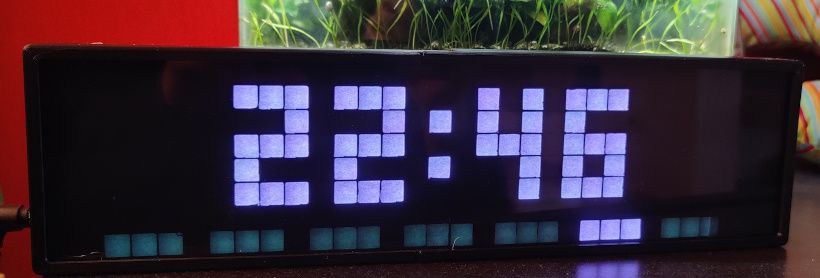

# PixelClock, smarte LED Matrix
Die PixeClock zeigt im Standard die Uhrzeit und Datum an (per NTP bezogen). Per MQTT bzw. API Schnittstellen können aber auch sogenannte Screens mit Text und Icons angezeigt werden. Ein Helligkeitssensor regelt die Helligkeit der Anzeige je nach Lichtstärke im Raum.
Basierend ist diese Anzeige auf dem Projekt [PixelIT](https://github.com/o0shojo0o/PixelIt), das Gehäuse ist mit dem 3D-Drucker gedruckt.

Benötigtes Material:

- 3D-Drucker für das Gehäuse
- Wemos D1 Mini
- WS2812 8x32 Matrix
- optional: Helligkeitssensor, z.B. LDR GL5516
- weiteres Infos zur Hardware und Software beim Projekt:
    - [bei Github](https://github.com/o0shojo0o/PixelIt)
    - [Doku Seite](https://docs.bastelbunker.de/pixelit/)
- Gehäuse zum Drucken:
    - [Gehäuse bei Thingiverse](https://www.thingiverse.com/thing:3559014)
    - [anderes Gehäuse](https://github.com/PricelessToolkit/Pixelit_Config):
      Dieses ist das auf den Fotos sichtbare Gehäuse. Nachteil beim Gehäuse ist, dass der Stromanschluß auf der Unterseite ist. Ich habe die STL-Dateien geändert, so dass der Stromanschluß seitlich wie auf den Fotos ist.
    - Als Diffusor nutze ich einfach ein Blatt Papier
    - Für die Tönung nutze ich eine Acrylglasplatte, z.B. [hier](https://www.hornbach.de/shop/Acrylcolorplatte-3x250x500-mm-glatt-grau/8055697/artikel.html)

